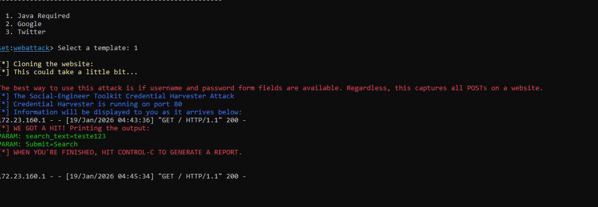

# 🎣 Phishing com Kali Linux - Desafio Cybersecurity

Este projeto faz parte do Bootcamp de Cibersegurança e consiste na simulação de um ataque de Phishing para captura de dados, realizado em ambiente controlado para demonstrar a insegurança de protocolos HTTP sem criptografia.

## 🛠 Ferramentas
* **Kali Linux** (OS Ofensivo)
* **Setoolkit** (Social-Engineer Toolkit)

## 📝 Relatório de Execução

### 1. Tentativa Inicial (Clonagem Direta - Facebook)
A primeira tentativa utilizou o módulo `Site Cloner` no Facebook.
* **Resultado:** O Facebook utiliza mecanismos avançados de telemetria e compressão, impedindo a leitura limpa das credenciais.
* **Evidência:** 

### 2. Bloqueios de Navegador
Ao tentar utilizar templates de login, os navegadores modernos bloquearam o envio de credenciais devido à ausência de HTTPS.

### 3. Prova de Conceito (PoC) - Java Template
Utilizamos o template "Java Required" para validar a interceptação.
* **Vetor de Ataque:** Campo de pesquisa ("Search Box").
* **Resultado:** O servidor interceptou com sucesso o texto enviado.

* **Dado Capturado:** `search_text=teste123`
* **Status:** **SUCESSO - WE GOT A HIT!**
* **Evidência Final:** 

---
**Disclaimer:** Este material foi produzido para fins educacionais.
